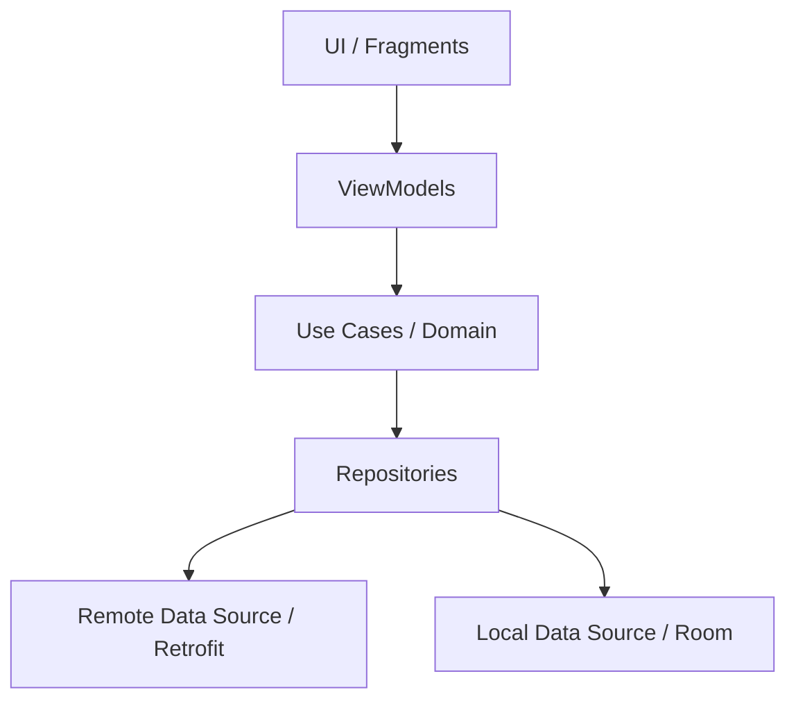
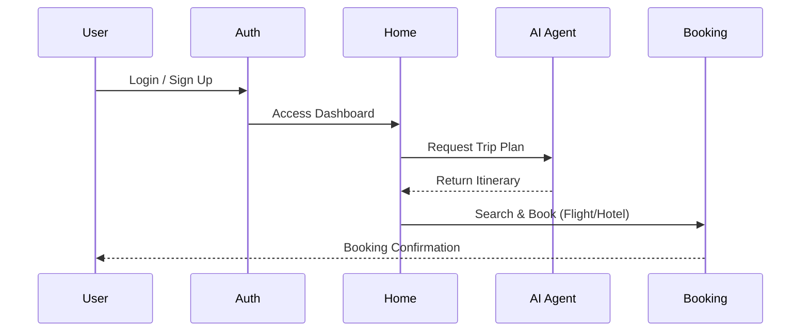

# 🌍 Rahhal (رحّال) - Your Ultimate Travel Companion

[](https://kotlinlang.org)
[](https://developer.android.com)
[](https://dagger.dev/hilt/)
[](https://square.github.io/retrofit/)
[](https://developer.android.com/training/data-storage/room)
[](https://developer.android.com/topic/architecture)
[](https://opensource.org/licenses/MIT)

**Rahhal** is a professional-grade Android application designed as a comprehensive solution for modern travelers. It bridges the gap between travel planning, social networking, and real-time assistance. Whether you are looking for your next adventure, wanting to connect with fellow explorers, or needing an AI assistant to plan your itinerary, Rahhal is built to be your all-in-one digital companion.

Developed as a graduation project, Rahhal leverages cutting-edge Android technologies and AI integrations to provide a seamless user experience. From high-performance networking with Retrofit to real-time communication via SignalR and intelligent trip matching, the app showcases a robust architecture and a feature-rich environment tailored for the global travel community.

---

## 🚀 Key Features

*   **🤖 AI-Powered Trip Planning (Tripr)**: A conversational AI agent that generates personalized itineraries based on user preferences.
*   **❤️ TripMatch**: A discovery tool with a "swipe" interface (similar to Tinder) for finding and matching with exciting travel opportunities.
*   **📸 Social Networking**: A full-featured social platform where users can post their travel experiences, share stories, and follow others.
*   **💬 Real-time Chat**: Secure messaging powered by SignalR for instant communication between travelers.
*   **🏨 Complete Booking Engine**: Integrated search and booking for **Flights**, **Hotels**, and **Guided Tours**.
*   **🗺️ Interactive Maps**: Real-time location services using Google Maps and MapLibre for navigating destinations.
*   **🗣️ LiveLingo**: Built-in AI translation tool to help travelers overcome language barriers.
*   **💳 Secure Payments**: Integrated payment flow for booking management.
*   **👤 Role-Based Experience**: Tailored experiences for Guests and Registered Travelers.

---

## 🛠️ Tech Stack

*   **Programming Language**: [Kotlin](https://kotlinlang.org/)
*   **Architecture**: MVVM (Model-View-ViewModel) + Clean Architecture principles.
*   **UI Framework**: Android XML with **ViewBinding**, Material Design components.
*   **Dependency Injection**: [Hilt](https://developer.android.com/training/dependency-injection/hilt-android)
*   **Networking**: [Retrofit](https://square.github.io/retrofit/) & OkHttp for REST APIs, **SignalR** for real-time WebSockets.
*   **Local Database**: [Room Persistence Library](https://developer.android.com/training/data-storage/room) for caching and offline data.
*   **Image Loading**: [Glide](https://github.com/bumptech/glide)
*   **Maps & Location**: Google Maps SDK, MapLibre GL, and Fused Location Provider.
*   **AI Integration**: Custom AI services for trip generation and translation.
*   **Animations**: [Lottie](https://airbnb.design/lottie/) for engaging UI transitions and **Shimmer** for loading states.
*   **Other Libraries**: CameraX, FFmpeg (media processing), Markwon (Markdown rendering), FlexBox, Lottie.

---

## 📂 Project Structure

```text
Rahhal/
├── app/
│   ├── src/
│   │   ├── main/
│   │   │   ├── java/com/example/rahhal/
│   │   │   │   ├── ui/             # UI Components (Activities, Fragments, ViewModels)
│   │   │   │   │   ├── authentication/  # Login, Signup, OTP
│   │   │   │   │   ├── home/            # Dashboard & Feature fragments
│   │   │   │   │   ├── onboarding/      # App introduction
│   │   │   │   │   └── payment/         # Payment processing
│   │   │   │   ├── data/           # Data Layer (Repositories, APIs, Local DB)
│   │   │   │   │   ├── api/             # Retrofit services & Interceptors
│   │   │   │   │   ├── local/           # Room DB, DAOs, Entities
│   │   │   │   │   └── repositories/    # Repository implementations
│   │   │   │   ├── domain/         # Domain Layer (Use Cases, Domain Models)
│   │   │   │   └── utils/          # Helper classes & Extensions
│   │   │   ├── res/                # Resources (Layouts, Drawables, Navigation)
│   │   │   └── AndroidManifest.xml # Permissions & Components
│   └── build.gradle.kts            # App-level dependencies
└── build.gradle.kts                # Project-level configuration
```

---

## 🏗️ Architecture Explanation

The project follows the **Clean Architecture** pattern to ensure scalability, maintainability, and testability:

1.  **Presentation Layer (UI)**: Handles the UI and user interactions. ViewModels communicate with the Domain layer to fetch data and update the UI via LiveData or StateFlow.
2.  **Domain Layer**: Contains the core business logic. It is independent of any other layer and contains Use Cases and Repository interfaces.
3.  **Data Layer**: Responsible for data operations. It implements the Repository interfaces and decides whether to fetch data from a remote API (Retrofit) or local database (Room).



---

## 🔄 Main User Flow



---

## 🌐 API Integration

The app communicates with several backend services:
*   **Main API**: `https://rahalbk.runasp.net/` (Auth, Social, Trips, Bookings)
*   **AI Service**: `https://driven-committees-parade-burner.trycloudflare.com` (Agent, Translation)
*   **SignalR Hub**: For real-time chat and notifications.

---

## 🔑 Permissions Required

*   `INTERNET`: For API calls and real-time updates.
*   `ACCESS_FINE_LOCATION` & `ACCESS_COARSE_LOCATION`: For map features and personalized travel suggestions.
*   `CAMERA`: For capturing profile pictures and social posts.
*   `READ/WRITE_EXTERNAL_STORAGE`: For uploading and saving media.
*   `RECORD_AUDIO`: For voice-based AI interactions.
*   `POST_NOTIFICATIONS`: For alerts and chat messages.

---

## 🛠️ Setup & Build Requirements

### Build Requirements
*   **Android Studio**: Hedgehog (2023.1.1) or newer.
*   **JDK**: Version 11.
*   **Gradle**: Version 8.x.
*   **SDK**: Min SDK 24, Target SDK 35.

### Setup Instructions
1.  **Clone the repository**:
    ```bash
    git clone https://github.com/your-username/Rahhal.git
    ```
2.  **Open in Android Studio**: Wait for Gradle sync to complete.
3.  **API Keys**:
    *   Add your Google Maps API Key in `local.properties`: `MAPS_API_KEY=your_key_here`.
    *   The app uses `${MAPS_API_KEY}` which is injected via the `secrets-gradle-plugin`.
4.  **Run**: Select your device/emulator and click the **Run** button.

---

## 🔮 Future Improvements

*   **Dark Mode**: Full support for dynamic theme switching.
*   **Offline First**: Enhanced caching for full offline trip management.
*   **AR Navigation**: Integration of Augmented Reality for city tours.
*   **Multi-currency Support**: Automatic currency conversion in payments.

---

## 👥 Contributors

*   **Your Name / Team Name** - *Initial work* - [Profile](https://github.com/your-username)
*   (Add more contributors here)

---

## 📄 License

This project is licensed under the MIT License - see the [LICENSE](LICENSE) file for details.

---

Developed with ❤️ for the Travel Community.
